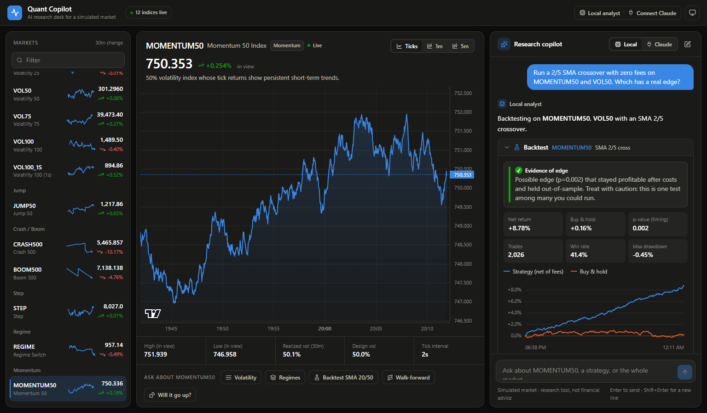
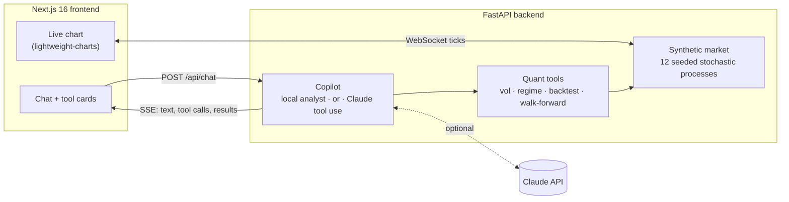
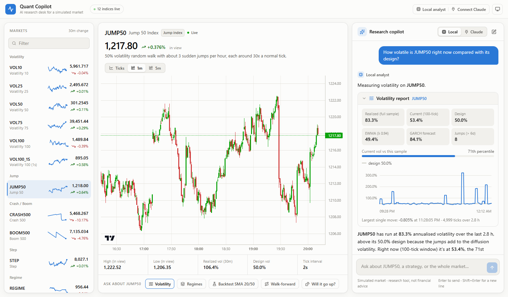

# Quant Copilot

An AI research desk for a simulated market of synthetic indices. Ask questions in plain English ("which index is calmest right now?", "backtest a 20/50 SMA crossover on VOL75 with a 1% stop") and the copilot answers by running real quantitative tools on live tick data, then tells you honestly whether anything beats random.

**It works out of the box, with no API key:** a built-in local analyst handles the questions the app is built for. Connecting Claude from the UI is an optional upgrade for open-ended reasoning.



## Why it's built this way

Synthetic indices are generated by random processes. A trading assistant that "finds" profitable strategies on them is overfitting, and a good one should say so. This project's central design choice is **statistical honesty**:

- Every backtest is compared against a **circular-shift null test**: the strategy's own positions are rotated in time 500 times, keeping exposure, turnover and holding periods but breaking any link to prices. The p-value measures whether the entry timing beats that null.
- Results separate three questions: is the timing better than random, does it survive costs, and does it hold out-of-sample?
- **Walk-forward optimisation** shows how much of an optimised strategy's performance is curve-fitting.
- The simulator includes a **planted-edge control** (`MOMENTUM50`, with autocorrelated returns) so the pipeline is provably able to find an edge when one exists, and a pure random walk as a negative control.

| Test (from the suite) | Result |
|---|---|
| Fast SMA crossover on `MOMENTUM50` (planted edge), zero fees | p = 0.002, the minimum possible with 500 simulations |
| Same strategy on `VOL50` (pure random walk) | p = 0.61, "no statistically significant edge" |
| Same edge on `MOMENTUM50` with 1 bp fees | Timing still significant, but reported as "does not survive costs" |
| Realized-vol estimator on `VOL10` / `VOL25` / `VOL75` / `VOL100_1S` | Recovers design volatility within 3% |

## Features

- **Trading-terminal UI**:
  - A watchlist of 12 live indices with sparklines and 30-minute change.
  - A live tick chart with 1m and 5m candlestick modes.
  - One-click analyses for the selected index.
  - A light/dark theme, and a responsive layout down to phone width.
- **Two copilot engines, one interface.** Both call the same tools and stream the same events, so the chart cards look identical whichever engine answers.
  - **Local analyst** (default, no API key): a rule-based planner. It parses the question (symbols, intents, strategy parameters, candle size, lookback), runs the tools and writes a plain-English answer from the results. It handles follow-ups ("now add a 1% stop", "what about VOL50?") and declines unsupported strategies. Asked for a prediction, it explains why that's impossible and gives the volatility-implied one-hour range instead.
  - **Claude** (optional): Claude with tool use, for free-form questions. Connect it from the **Connect Claude** button. The backend verifies the key, which is never sent back to the browser, and can optionally save it to `backend/.env`.
- **Quant tools**:
  - Volatility report: realized, rolling, EWMA and a GARCH(1,1) forecast, plus robust jump detection.
  - Noise-aware regime detection.
  - Cross-index volatility ranking.
  - Backtester with stop-loss and take-profit, fees, an in-sample/out-of-sample split and the null test.
  - Walk-forward optimiser.
- **Safe strategy language**: the model never writes code. It fills in a pydantic-validated strategy spec (SMA cross, RSI, breakout, direction, SL/TP, fees), and invalid specs come back as errors it can correct.
- **Light and dark themes**, a responsive layout, keyboard-accessible controls, and screen-reader data tables behind every chart.

## Architecture



- `backend/app/market/`: price models (GBM, jump-diffusion, crash/boom, step, Markov regime-switching, AR(1) momentum) and a real-time clock that backfills 50,000 ticks per index and appends new ones at each index's tick interval.
- `backend/app/quant/`: volatility estimators, regime detection, strategy spec, backtester and walk-forward. Pure NumPy/pandas, no network.
- `backend/app/agent/`:
  - Tool schemas, generated from the pydantic input models.
  - The Claude system prompt and a manual streaming tool-use loop (`loop.py`).
  - The local analyst: a rule-based parser (`parse.py`), a planner and engine (`local.py`), and results-to-prose narration (`narrate.py`).
- `backend/app/api/`:
  - REST, WebSocket and SSE endpoints.
  - A watchlist snapshot endpoint.
  - Claude key connect and disconnect.
  - A per-client rate limit on Claude chat.
- `frontend/src/`: the watchlist, live chart, chat panel, Connect Claude dialog and one card component per tool.

### Design notes

- **No look-ahead.** A position decided at the close of bar *t* earns the return from *t* to *t+1*. A test proves every signal computed on a truncated history equals the full-history signal at every bar.
- **Regimes are only reported when they exceed sampling noise.** Rolling volatility is labelled calm or turbulent only when it moves beyond ±3 standard errors of a rolling standard deviation (±21% for a 100-tick window). A constant-volatility index correctly shows one regime; naive tercile labelling would invent three.
- **The event loop never stalls.** Market data is snapshotted on the event loop, and CPU-heavy work (GARCH fits, 500-run null tests) runs in worker threads, so live ticks keep flowing during a backtest.
- **Model-facing and UI-facing results are split.** Each tool returns a compact JSON payload for Claude, with floats trimmed and no chart series, and a separate chart payload for the UI. The system prompt and tool definitions are cached across requests.

## The synthetic market

| Symbol | Process | Tick |
|---|---|---|
| `VOL10` … `VOL100` | Random walk, constant 10–100% annualised volatility | 2s |
| `VOL100_1S` | Random walk, 100% volatility | 1s |
| `JUMP50` | 50% volatility plus about 3 jumps an hour, each around 30× a normal tick | 2s |
| `CRASH500` / `BOOM500` | Steady drift, with a sharp move against it on average every 500 ticks | 1s |
| `STEP` | Exactly ±0.1 every tick | 1s |
| `REGIME` | Markov switching between 20% and 90% volatility, regimes lasting about 15 min on average | 2s |
| `MOMENTUM50` | AR(1) returns with φ = 0.15 at 50% volatility: the planted-edge control | 2s |

Everything is seeded (`COPILOT_MARKET_SEED`), so a given seed and start time reproduce the same history.



## Running locally

Requirements: Python 3.12+ (developed on 3.14) and Node 20+.

**Backend**

```bash
cd backend
python -m venv .venv
.venv/Scripts/activate            # macOS/Linux: source .venv/bin/activate
pip install -r requirements.txt
cp .env.example .env              # optional: set ANTHROPIC_API_KEY
uvicorn app.main:app --port 8000 --reload
```

**Frontend**

```bash
cd frontend
npm install
npm run dev                       # http://localhost:3000
```

Everything works without an API key: the copilot uses the local analyst. To use Claude, click **Connect Claude** in the app, or set `ANTHROPIC_API_KEY` in `backend/.env`. Settings live in `backend/.env` under a `COPILOT_` prefix: model, effort, seed, CORS origin, rate limit and maximum tool rounds. See [`backend/.env.example`](backend/.env.example). The default model is `claude-opus-5`. `COPILOT_CLAUDE_MODEL=claude-sonnet-5` is cheaper.

## Tests and evals

```bash
cd backend
.venv/Scripts/python -m pytest                          # 112 tests, about 5s, no API calls
.venv/Scripts/python -m evals.run_evals --engine local  # 20 questions, local analyst (free)
.venv/Scripts/python -m evals.run_evals                 # the same 20 against Claude (uses API credit)
```

The unit tests cover:

- Hand-computed backtest cases, costs and stop/target exits.
- The no-look-ahead proof.
- Null-test power: it must detect perfect foresight.
- Estimator accuracy against simulated processes.
- Simulator determinism.
- Tool validation and errors.
- The local analyst's parser: symbols, intents, strategies and modifiers.
- The local analyst's engine: tool choice, follow-ups, prediction refusal and unsupported strategies.
- Claude key verification and saving.
- The agent loop against a scripted fake client: parallel tool calls, errors fed back to the model, and the iteration cap.
- The REST, WebSocket and SSE endpoints.

The eval checks that the engine picks the right tools for 20 representative questions. It also checks that it declines unsupported strategies such as MACD instead of silently substituting one, and that it refuses to predict prices. The local analyst scores 20/20, but its rules were written with these questions in view, so treat that as an in-sample score. The parser unit tests cover other phrasings. The Claude score depends on the model and is recorded when you run it with a key.

## Limitations

- Stops and targets fill at the bar close, because the data is ticks and candle closes with no intrabar path.
- Annualised Sharpe ratios from 1–2 second ticks can reach very large magnitudes. Read them alongside total return and the p-value.
- The rate limiter and market state live in memory, so this is a single-process design. Scaling out would need Redis or similar for both.
- The local analyst is rule-based. It covers the app's question types and many phrasings, but free-form questions outside them get a help message; Claude handles those.
- Only the strategies in the spec are supported. Adding one means adding a pydantic model and a signal function, and the tool schema updates itself.

Simulated data only. This is a research and education project, not financial advice.
